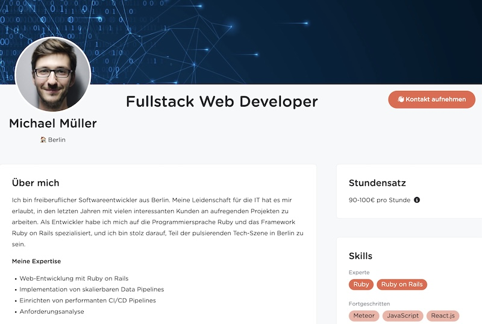

# 🧑‍🏫 Public Profiles

As a member of Uplink you can create a public profile to showcase your skills, knowledge and project experience:

Creating a profile is optional, but it can help you to receive direct enquiries from clients. A form is integrated below each profile, which clients can use to contact you. We will forward every contact request to you after a brief check to avoid spam.

:::info Beta phase

Since public profiles are a relatively new feature of Uplink (launched December 2023), we want to make sure that they work really well and are easy to set up before we release them to all members.

Therefore, profiles are still in a **beta phase**, which means that any member can express interest in their own profile in the [member area](https://my.uplink.tech/profile) and we will gradually invite those interested to create a profile.

:::

## Sections

Your profile consists of these sections:

### Name, city and tagline

The city helps potential clients to assess how easy it is to organise a personal meeting. The tagline is a short description of yourself, e.g. "Fullstack Developer with focus on React.js".

### About me

Here you can describe yourself, your motivation and your experience in several paragraphs.

### Projects

In your project list, you should list the 3-10 most important projects of the last few years and indicate the title and time period for each project and describe the skills and technologies used as well as your tasks.

### Hourly rate

Displaying the hourly rate is optional. However, it can help at an early stage to avoid client enquiries with a budget that is too low.

### Skills

Here you can specify your skills and knowledge and categorise them as "Junior", "Advanced" or "Expert".

### Education

Enter your education in this section, e.g. studies, training or further education.

### Language skills

Here you should indicate how well you speak German, English and possibly other languages.

## Features

If you are interested in a feature marked with "**🤷‍♂️ Maybe**", [please write to us](mailto:hello@uplink.tech)! We will only implement these features once we have received enough feedback from members who want to use them.

| Feature | Status | Details |
| --- | --- | --- |
| **Multiple languages** | 🤞&nbsp;Soon | You will be able to set up your profile in both German and English. |
| **Export as PDF** | 🤞&nbsp;Soon | You will be able to export your profile as a machine-readable, ATS-compatible and good-looking CV in PDF format. |
| **Export as JSON** | 🤞&nbsp;Soon | You will be able to export your profile in JSON format (e.g. [JSON Resume](https://jsonresume.org/)). |
| **Export/Sync to GitHub** | 🤞&nbsp;Soon | You will be able to export or automatically sync your profile in JSON format to GitHub (or Gitlab etc.). |
| **Export via API** | 🤞&nbsp;Soon | You will be able to export your profile in JSON format via our API. |
| **Display availability** | 🤞&nbsp;Soon | You will (optionally) be able to display your current and future availability on your profile. |
| **Display certificates** | 🤞&nbsp;Soon | You will be able to display certificates (e.g. SCRUM, ISTQB, ITIL, AWS) on your profile. |
| **Display insurances** | 🤞&nbsp;Soon | You will be able to display insurances (e.g. liability insurance) on your profile. |
| **Import/change via API** | 🤷‍♂️&nbsp;Maybe | You will be able to import or change your profile via our API. |

Translated with www.DeepL.com/Translator (free version)
