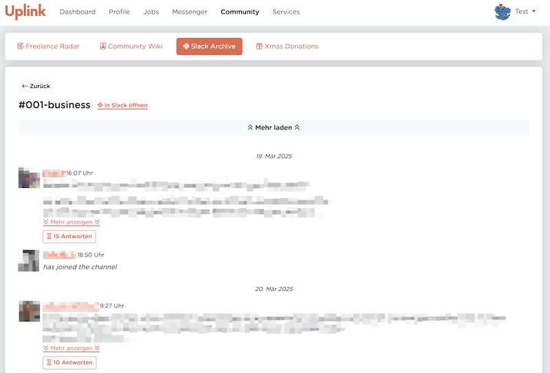
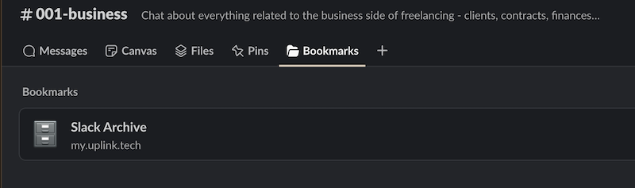
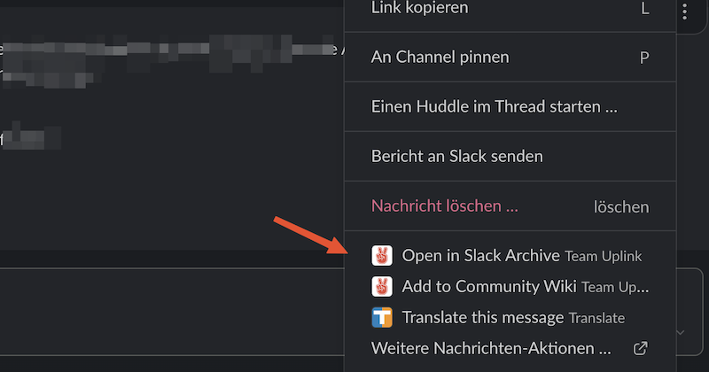

# 🗄️ Slack Archive {#slack-archive}

## 🤔 What is the Slack Archive?

The **Slack Archive** is a database of all messages from our [Community Slack](../060-community-slack.md), which is accessible to all members of Uplink in the [Member Area](../110-member-area.md).

## 🎯 What problem does it solve?

We use the free version of Slack for our Community Slack, which has the restriction that [only messages from the last 90 days are displayed](https://slack.com/intl/de-de/pricing/paid-vs-free).
All messages sent more than 90 days ago are hidden by Slack.

For our public channels, this means that valuable discussions, links and tips from the past disappear from the history!

The problem is even more serious for the [application channels](../060-community-slack.md#application-channels), which are automatically created for every job application. Sometimes important issues are discussed there at the beginning of a project that are still relevant several months later (e.g. questions about invoicing or agreements with the client) and must be viewed by the applicant and the Uplink team.

**With the Slack Archive, we ensure that all content is permanently preserved.**

## 🚀 How do I use it?

There are various ways to access the Slack Archive:

1. in the [member area](../110-member-area.md) you will find the Slack Archive under the menu item "Community".
2. in every public Slack channel, the Slack Archive can be accessed via "Bookmarks":
   
3. on every message in Slack you will find the option "Open in Slack Archive" after clicking on the three dots:
   

## 💡 Best practices

* The Slack Archive supports links to a channel or to a single message. These links can be used instead of the links to channels or messages directly in the Community Slack to ensure that they are still accessible after several months.

## ❓ FAQ

* **Is there a search?** 
  The search functionality has not yet been implemented, but is on our to-do list! 🤞

* **Who has access to which channels?** 
  Every user has access to exactly those channels to which they also have access in Slack (i.e. which they have joined). For private channels in particular, this means **only the members of the private channel can also read the messages in the Slack Archive**. 
  Messages from Slack chats (not channels) between two or more users are never transmitted to our servers and therefore cannot be displayed in the Slack Archive.

* **What happens when a user deactivates their Slack account** 
  Deactivated users and their messages will not be displayed in the Slack Archive and will be replaced with `[user deactivated]`.

## 📚 Further links

* https://slack.com/intl/de-de/pricing/paid-vs-free
